# SOC_LAB4-2 - Execute FIR code in user BRAM
## Simulation for FIR
```sh
cd ~/SOC_LAB4-2/testbench/counter_la_fir
source run_clean
source run_sim
```
## Design block diagram – datapath, control-path
### Firmware block diagram
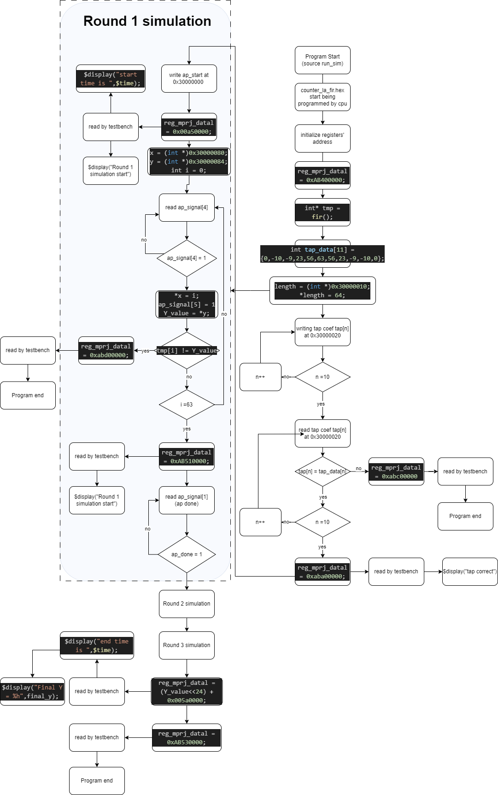
### User project block diagram
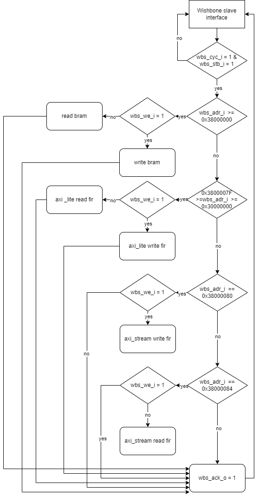
### FIR engine data flow
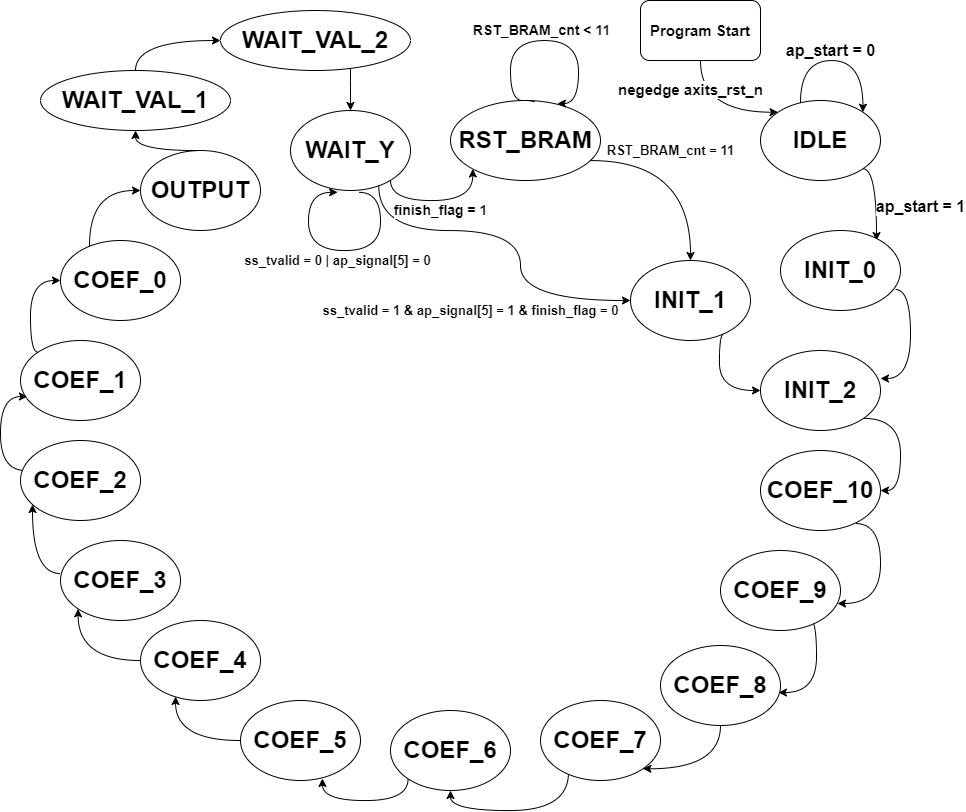

## The interface protocol between firmware, user project and testbench
### Interface between firmware(cpu) and user project: wishbone
- The only way we communicate cpu and user project in lab4_2_project is 
by using wishbone interface.
In wishbone protocal, user project act the role as wishbone slave,which 
being read and write passively by cpu.
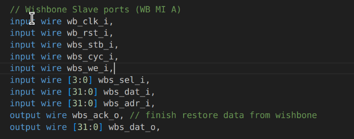
###  Interface between firmware(cpu) and testbench: mprj_io, spi_flash
- mprj_io: In firmware, we write data into mprj_io register for testbench 
to read start_mark, end_mark, latency_start_mark, 
latency_end_mark.
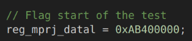
-  spi_flash: In testbench, we instantiate a VIP named spiflash which can 
transfer .hex into instruction set and then send it to cpu through 
spi_flash protocal interface
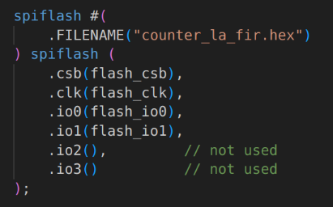

## Waveform and analysis of the hardware/software behavior
### Data feeding (wishbone)
- Through wishbone interface, cpu write data at 0x300000080.
When “cycle, stb, we” high, wishbone is valid in write mode. we take data 
from wbs_data_i and do the fir calculation.
When the calculation complete, we set wbs_ack high to complete this
“write data instruction”.
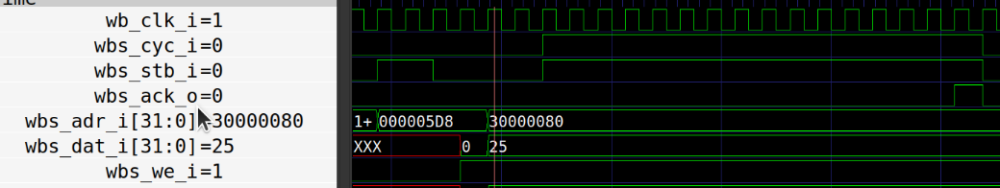
###  Data reading(wishbone)
- When cyc, stb high and we low, wishbone is valid in read mode. We put 
the Y[n] data on wbs_dat_o wire and then set wbs_ack high.
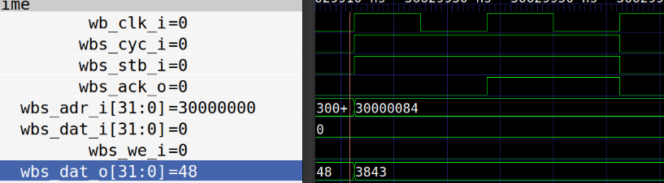
### mprj data writing(wishbone)
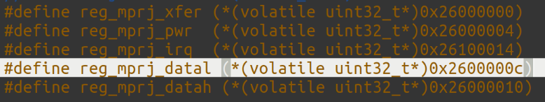
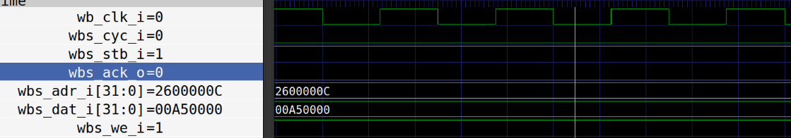
- As the above, we store mprj data in 0x2600000c.

## What is the FIR engine theoretical throughput, i.e. data rate? Actually 
measured throughput?
- Since there only needs 17 states in FSM from read the data to output the 
data, the latency is 17 cycles, which is 212.5ns/data (cycle time * cycle = 
12.5ns * 17). Hence the throughput is 1(FIR 
instruction)/212.5ns(execution time), which is equal to 4.7E6.
- As measured from the FIR waveform, the start time stamp of first input is 
21528937ns, and the end time of FIR last input is 32025137ns. The 
execution time of 64 inputs is 10496200ns, thus the throughput is 6097, 
which has large variance with theoretical throughput of 4.7E6.
- The reason making the difference between theoretical and measured
throughput is that, there are some other operations or stalls between the 
FIR input, so the FIR engine cannot receive the input data immediately 
after the last output data.
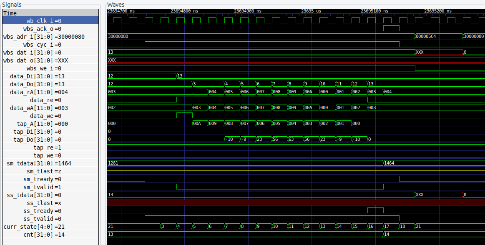

## What is latency for firmware to feed data?
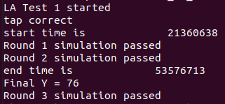
- As the above, total latency for firmware to feed data and check data is
32216075ns, that is 3.22s.
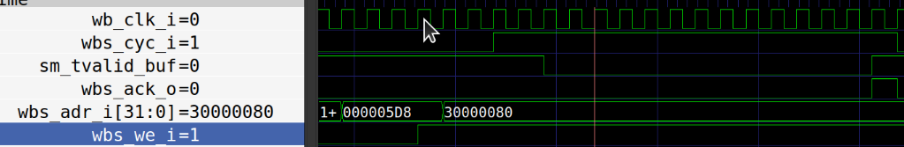
- As the above, we can also observe the wishbone interface. The latency for 
firmware to feed one data take about 18 cycles, that is 225ns.

## What techniques used to improve the throughput?
### Does bram12 give better performance, in what way?
- bram12 does give better performance. Comparing to the previous BRAM 
model, bram12 can read and write in the same cycle which the previous 
BRAM cannot. Thus, the read/write operation can be more efficiency.
- In our design, we utilize the characteristic of bram12, reading and writing 
the data from bram12 in the same cycle (reduce 1 FSM state), save more 
time to gain larger throughput (1 cycle can be saved comparing to our 
previous design).
### Can you suggest other method to improve the performance?
-  Since the FIR can only use 1 multiplier and 1 adder, the FIR cannot 
process more than 1 input at the same time (parallelly). The only way to 
improve the throughput is to make the latency of each input as small as 
possible.
- Calculate the oldest input signal in the first cycle while storing the newest 
input signal, then calculate each input signal from the oldest to the 
newest may lead to the most efficient design.
- With some extra states for setting transmission protocol signals, 17 
cycles (states) is the minimum latency we can make in our design.
